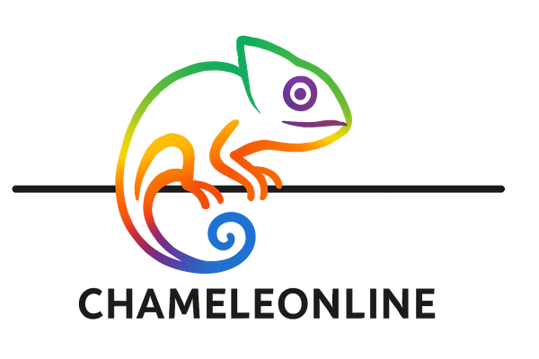

Website for events related to *C*omputational and m*A*thematical *ME*thods in machine *LE*arning, *O*ptimization and i*N*ference (**ChAMELEON**).

**Website:** https://andreasmang.github.io/chameleonline/

## Editing the site

The site is built with Jekyll and deployed to GitHub Pages on every push to `main`.

| What | Where |
|------|-------|
| Summer school 2025 content (topics, schedule, speakers, posters, participants, reading list) | `_data/summerschool2025.yml` |
| Home page | `index.html` |
| Participants and posters page | `pages/2025-SUMMERSCHOOL.html` |
| Page template (header, navigation, footer) | `_layouts/default.html` |
| Styles | `assets/css/site.css` |
| Images and logos | `files/` |
